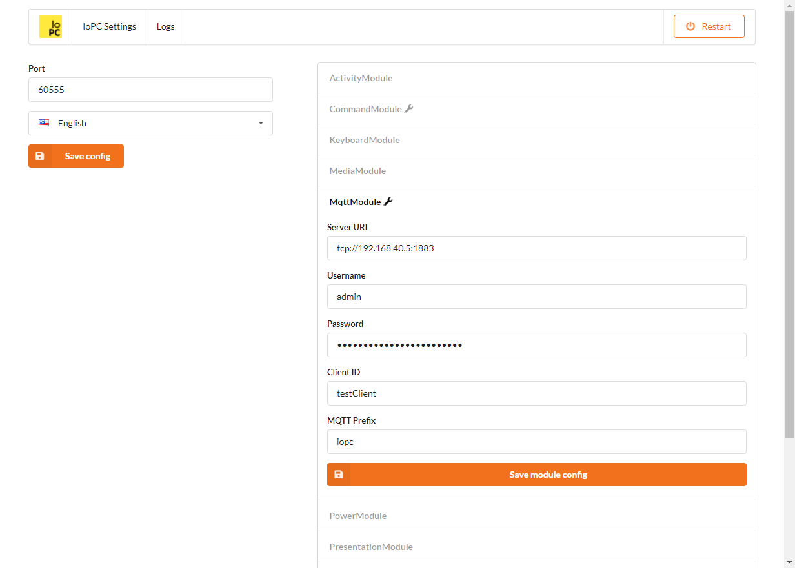
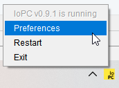

# IoPC
(aka Internet of PC)

## What is it?
IoPC is a service program that lets you integrate your PC into smart home system.
Now it supports MQTT protocol, so you can integrate IoPC with [HomeAssistant](https://www.home-assistant.io/).

## Configuration
IoPC has web interface where you can configure app, and it's modules which is available on [http://127.0.0.1:60555/](http://127.0.0.1:60555/) by default.


You can quickly open it via tray icon:



Also you can configure IoPC with env vars:
```
IOPC_MQTT_SERVER_URI=tcp://127.0.0.1:1883
IOPC_MQTT_USERNAME=mylogin
IOPC_MQTT_PASSWORD=mypassword

# Default MQTT prefix for IoPC
IOPC_MQTT_PREFIX=iopc
# Client ID is used to generate MQTT topic for individual computer
IOPC_MQTT_CLIENT_ID=myComputer
```

## Services
By default, inbound MQTT prefix for IoPC instance is `{MQTT_PREFIX}/{MQTT_CLIENT_ID}/command/#`.
You can publish any messages to subtopics, and they will be parsed by MqttModule.

For example, we want to set PC volume from HomeAssistant. We should send following message to topic `iopc/myComputer/command/homeassistant`
```json
{
  "service": "volume.set",
  "payload": {
    "volume": 54
  }
}
```

### Available services
| Service | Payload | Description |
| --- | --- | --- |
| keyboard.press | `{ "keyCode": 65 }` | Presses the button on keyboard with specified keyCode |
| media.control | `{ "action": "PLAY_PAUSE" }` | Controls multimedia by simulating virtual keys (you can find them on some keyboards). Available actions: `PLAY_PAUSE`, `VOLUME_UP`, `VOLUME_DOWN`, `MUTE`, `PREVIOUS`, `NEXT`, `STOP` |
| presentation.control | `{ "action": "NEXT" }` | Controls PowerPoint/LibreOffice/etc presentation via pressing arrow keys or F5/ESC to start or end presentation. Available actions: `NEXT`, `PREVIOUS`, `START`, `STOP` |
| volume.set | `{ volume: 54 }` | Sets audio volume |
| volume.get | `{}` | Publishes actual audio volume to MQTT |
| command.execute | `{ "entrypointId": "help", "environment": { "KEY": "VALUE", "KEY2": "VALUE2" } }` | Runs custom command which must be defined in **CommandModule** configuration, e.g. for EntrypointID `run-explorer`, entrypoint can be `explorer.exe` |
| power.shutdown | `{}` | Shutdown computer |
| power.reboot | `{}` | Reboot computer |
| power.sleep | `{}` | Suspend computer |
| power.hibernate | `{}` | Hibernate computer |


### Sensors
By default, outbound MQTT prefix for IoPC instance is `{MQTT_PREFIX}/{MQTT_CLIENT_ID}/#`.
Under this prefix you can find values from PC indicators.
For example, PC volume level will be published to topic `iopc/myComputer/volume/level` as integer (e.g. `54`)

For now, sensors are not updated automatically, so you should run a special service to update sensor value.

### Available sensors
| Sensor topic | Value example | Description |
| --- | --- | --- |
| state | `online` | Availability topic of IoPC. Can be `online` or `offline` |
| volume/level | `54` | Audio volume. You must call `volume.get` service to refresh value of this sensor |
| sysinfo/ram/free | `8575254528` | Free RAM in bytes |
| sysinfo/ram/total | `9940004528` | Total RAM in bytes |
| sysinfo/cpu/usage | `14` | CPU usage in % |
| sysinfo/drive/{id} | `{ "path": "C:\\", "totalSpace": 255414235136, "freeSpace": 96031997952, "usableSpace": 96031997952 }` | Drive info. `{id}` - number of drive, starts from `0`. |
| activity/lastUserInput | `2021-05-25T18:52:00.0123287` | Last user input (e.g. mouse movement or keyboard press) |
| activity/state | `active` | User state. Can be `active`, `idle` (if not active for 30sec), `away` (if not active for 5min), `unknown` |


